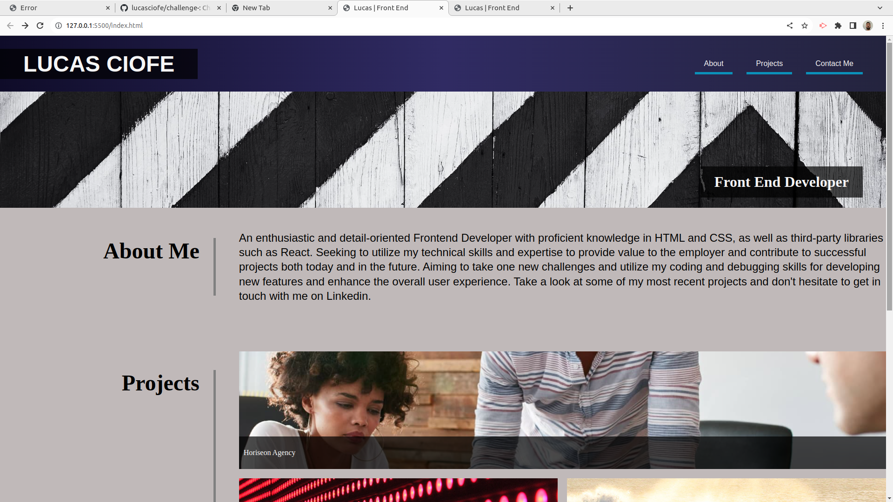

# Portfolio-lucas

## Description 
The Second Challenge was created for students in Edx boot camp. It contains how to use CSS Flexbox and Grid for good design of web content, and used queries 
to optimize view to mobile and tablets.

## Installation
N/A

## Usage

To see this web page above you can access through this link[Portfolio](https://lucasciofe.github.io/portfolio-lucas/).
During this project cover about CSS `Flexbox` and `Grid`, `@media`queries for best experience in small devices, In the part of project just the first screen of Horiseon agency has a link of my previous project on this course.

## Credits
N/A

## License
MIT license.